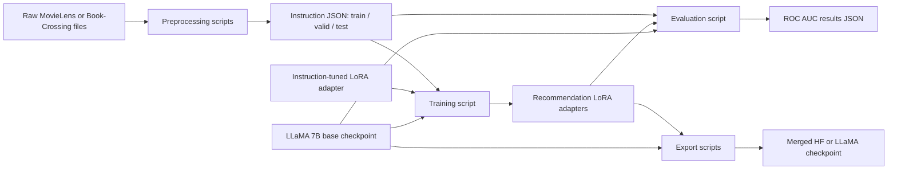

# TALLRec: System Design and Architecture

## Architectural classification

TALLRec is a local, batch-oriented ML research pipeline organized as independent Python scripts. It is closest to a modular monolith, although it has no long-running application process, API tier, MVC structure, frontend, database, or microservices. Files and model checkpoints are the integration boundary between preprocessing, training, evaluation, and export stages.

## Components and responsibilities

| Component | Responsibility | Inputs | Outputs |
|---|---|---|---|
| `preprocess_movie.py` | Convert MovieLens 100K interactions to histories and prompts | `u.data`, `u.item`, `u.user` | CSV baselines and JSON splits |
| `preprocess_book.py` | Convert Book-Crossing ratings/catalog into prompts | `BX-Book-Ratings.csv`, `BX-Users.csv`, `BX-Books.csv` | mapping CSV, baseline CSVs, JSON splits |
| `finetune.py` | Generic Alpaca instruction tuning | base LLaMA, instruction dataset | LoRA adapter |
| `finetune_rec.py` | Single-domain recommendation tuning with AUC model selection | base LLaMA, one train and validation dataset, optional initial adapter | best recommendation LoRA adapter |
| `finetune_multi_rec.py` | Mixed-domain training | base LLaMA, two train and two validation paths | LoRA adapter; only the first validation set is actually used |
| `evaluate.py` | Offline inference and AUC aggregation | base LLaMA, adapter, test JSON | nested result JSON |
| `export_hf_checkpoint.py` | Merge LoRA into a Hugging Face model | `BASE_MODEL`, hard-coded adapter ID | `hf_ckpt/` |
| `export_state_dict_checkpoint.py` | Merge and translate weights to original LLaMA naming | `BASE_MODEL`, hard-coded adapter ID | `ckpt/consolidated.00.pth`, `params.json` |
| `shell/*.sh` | Parameterized experiment orchestration | GPU ID, seed/output path, edited placeholders | trained adapters and metrics |

## Technology stack

- **Language/runtime:** Python; Bash for launch automation.
- **ML runtime:** PyTorch, CUDA, FP16, and optional `torch.compile`.
- **Model framework:** Hugging Face Transformers 4.28.0 using `LlamaForCausalLM`, `LlamaTokenizer`, `Trainer`, `TrainingArguments`, and generation utilities.
- **Parameter-efficient tuning:** Hugging Face PEFT 0.3.0 with LoRA; `loralib`; bitsandbytes 0.37.2 for 8-bit model loading.
- **Data:** Hugging Face Datasets, JSON, CSV, pandas, NumPy.
- **Metrics:** scikit-learn ROC AUC.
- **CLI/orchestration:** Python Fire, Bash, `CUDA_VISIBLE_DEVICES`, optional Accelerate/DDP environment variables.
- **Utilities:** tqdm; SentencePiece for LLaMA tokenization; Git LFS for the checked-in `.bin` adapter.
- **Declared but unused in active paths:** Gradio and appdirs. Gradio is imported by evaluation but no interface is created or launched. Black is development tooling.
- **Optional/inactive integration:** Weights & Biases parameters are present; generic tuning can report to W&B, while recommendation tuning disables it.
- **External artifacts/services:** a licensed/gated Hugging Face-format LLaMA checkpoint, optional Hugging Face Hub datasets/models, and the included or externally downloaded Alpaca-LoRA adapter. There is no database or application API.

## Training data flow

1. Fire converts command-line flags into arguments for `train()`.
2. Transformers loads the base LLaMA in 8-bit mode and loads its tokenizer.
3. PEFT prepares the quantized model and injects LoRA matrices into the configured attention projections.
4. Datasets loads local JSON or a Hub dataset. Recommendation training shuffles by seed and optionally samples a few-shot subset.
5. Each record is rendered as an Alpaca prompt. The tokenizer truncates to `cutoff_len`, optionally appends EOS, and copies input IDs into labels. If `train_on_inputs` is false, prompt tokens receive label `-100`.
6. `DataCollatorForSeq2Seq` pads batches to a multiple of eight. `Trainer` performs FP16 optimization with gradient accumulation.
7. Before metric calculation, logits are reduced to the hard-coded vocabulary IDs for `Yes.` and `No.` and converted into a binary probability. Validation ROC AUC drives checkpoint selection and early stopping.
8. A state-dict override filters saves to PEFT adapter parameters; `save_pretrained()` writes the compact adapter artifact.

## Evaluation data flow

1. Fire invokes `evaluate.main()` with base model, adapter directory, test JSON, and result path.
2. Device detection chooses CUDA, Apple MPS, or CPU; the base LLaMA and PEFT adapter are loaded on that device.
3. Test records become Alpaca prompts and are tokenized in batches of 32.
4. `model.generate()` produces the first generated-token scores. Evaluation selects vocabulary IDs `8241` and `3782`, normalizes them, and treats index 0 as the positive score.
5. Generated text and logits are attached in memory to each record, but only aggregate ROC AUC is persisted.
6. The AUC is stored under `training scenario → test scenario → model name → seed → sample`, with those keys inferred from path naming conventions.

## Key architectural decisions

- **Parameter-efficient transfer learning:** only LoRA matrices on query/value projections are trained and saved. This reduces trainable parameters, GPU memory, and artifact size.
- **Recommendation as instruction completion:** preference prediction is framed as language generation, allowing the same LLaMA/Alpaca training machinery to serve movie and book tasks.
- **Ranking-oriented model selection:** the pipeline uses the probability assigned to `Yes.` rather than string accuracy, and optimizes validation ROC AUC.
- **File-based pipeline:** JSON datasets, adapter directories, and result JSON files make stages independently runnable and easy to inspect, at the cost of concurrency and operational robustness.
- **Configuration by CLI and naming convention:** Fire avoids a bespoke configuration layer. Evaluation derives domain, seed, and sample metadata from directory names, creating tight coupling to shell-script output naming.
- **Optional data parallelism:** environment-driven `WORLD_SIZE`/`LOCAL_RANK` support delegates distributed execution to PyTorch/Transformers rather than implementing orchestration.
- **Checkpoint translation:** standalone exporters merge LoRA into the base model and optionally rename/permutate tensors for the original LLaMA layout.

The code does not implement dependency injection, repository/data-access patterns, events, queues, caches, or service discovery. Its main reuse pattern is framework composition: nested prompt helpers and Hugging Face callbacks/configuration inside each script.

